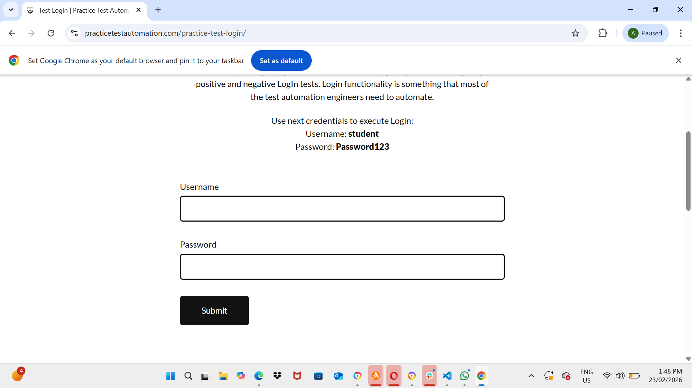
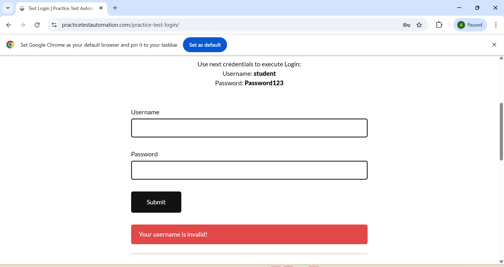
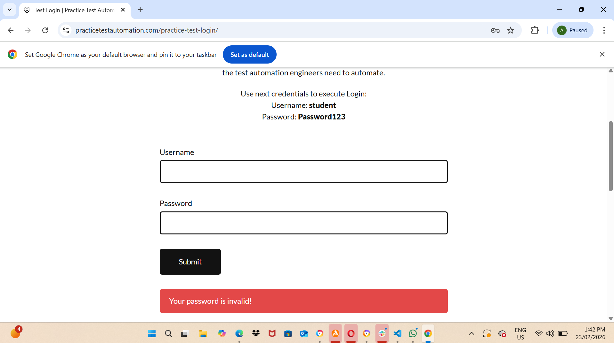

# Bug Reports — Login Feature Testing

---

## BUG-001
**Title:** Remember Me checkbox missing
**Severity:** Medium
**Priority:** Medium
**Status:** Open
**Date:** 23/02/2026
**Browser:** Chrome

**Description:**
Login page does not have a Remember Me 
checkbox which is standard login functionality

**Steps to Reproduce:**
1. Go to login page
2. Observe login form

**Expected Result:**
Remember Me checkbox visible below password field

**Actual Result:**
No Remember Me checkbox exists

**Screenshot:**

---

## BUG-002
**Title:** Forgot Password link missing
**Severity:** High
**Priority:** High
**Status:** Open
**Date:** 23/02/2026
**Browser:** Chrome

**Description:**
Login page has no Forgot Password link 
preventing users from recovering accounts

**Steps to Reproduce:**
1. Go to login page
2. Look for Forgot Password link

**Expected Result:**
Forgot Password link visible on login page

**Actual Result:**
No Forgot Password link exists

**Screenshot:**

---

## BUG-003
**Title:** Username field is case sensitive
**Severity:** Low
**Priority:** Low
**Status:** Open
**Date:** 23/02/2026
**Browser:** Chrome

**Description:**
Entering username in capitals fails login
causing poor user experience

**Steps to Reproduce:**
1. Enter username: STUDENT
2. Enter password: Password123
3. Click Login

**Expected Result:**
Login successful regardless of username case

**Actual Result:**
Invalid username error displayed

**Screenshot:**

---

## BUG-004
**Title:** Login page UI is poorly designed
**Severity:** Low
**Priority:** Low
**Status:** Open
**Date:** 23/02/2026
**Browser:** Chrome

**Description:**
Login page has multiple UI/UX issues 
affecting user experience

**Issues:**
- No Sign Up option for new users
- Input fields are excessively long
- Page looks unprofessional overall

**Steps to Reproduce:**
1. Open login page
2. Observe overall page design

**Expected Result:**
Professional looking login page with
standard UI elements

**Actual Result:**
Poorly designed page with oversized 
input fields and missing standard elements

**Screenshot:**

---

## BUG-005
**Title:** Generic error messages for empty 
and invalid credentials
**Severity:** Low
**Priority:** Low
**Status:** Open
**Date:** 23/02/2026
**Browser:** Chrome

**Description:**
Same error message shown for both empty 
fields and invalid credentials giving 
users no clear guidance

**Issues:**
- Empty username shows "Invalid username"
- Wrong username shows "Invalid username"
- Empty password shows "Invalid password"
- Wrong password shows "Invalid password"

**Expected Result:**
- Empty field: "Username/Password is required"
- Wrong credentials: "Invalid username/password"

**Actual Result:**
Same generic message for both scenarios

**Screenshot:**

---

## BUG-006
**Title:** Username field clears after 
failed login attempt
**Severity:** Medium
**Priority:** Medium
**Status:** Open
**Date:** 23/02/2026
**Browser:** Chrome

**Description:**
After failed login both fields clear 
forcing user to retype username

**Steps to Reproduce:**
1. Enter username: wronguser
2. Enter password: wrongpassword
3. Click Login
4. Observe username field is now empty

**Expected Result:**
Username field retains entered value
Password field clears for security

**Actual Result:**
Both fields completely clear after 
failed login

**Screenshot:**
